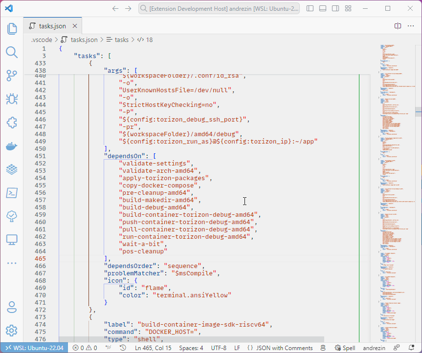

This extension allows you to jump to the definition of a label in the `tasks.json` file. It is useful when you have a large `tasks.json` file and you want to quickly jump to the definition of tasks from a `dependsOn` array.

